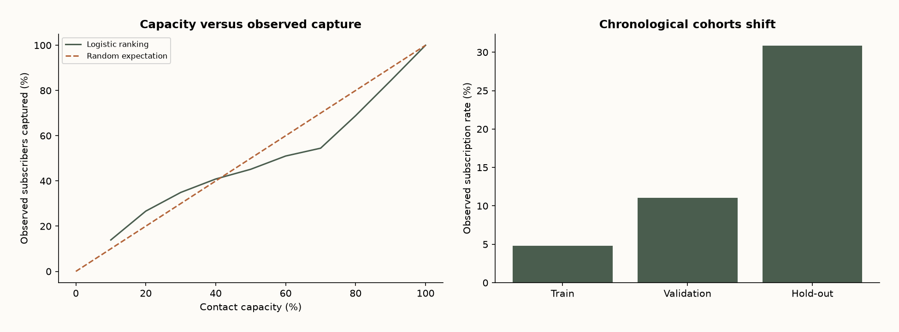

# When a banking model should not ship

Banking · Historical academic dataset

## Business question

Can contact capacity be prioritized using information available before a call—and does that ranking survive a later cohort?

## Method & validation

Use UCI’s 41,188 chronologically ordered records. Split 60/20/20 without shuffling, fit preprocessing on training only and exclude call duration, current campaign count and demographic fields. Audit ranking and calibration on reserved data.

## What the data says

Held-out AUC is 0.458. At 20% capacity the model captures 26.7% of observed subscribers, but the response rate shifts from 4.8% in training to 30.8% in hold-out. The positive top-capacity lift does not rescue overall ranking or calibration.

## Recommendation

Do not deploy this model. Investigate cohort construction and macroeconomic drift, obtain recent pre-contact data and validate a new policy before an experiment. No campaign ROI or causal uplift is claimed.

## Limits of the evidence

Portuguese campaigns from 2008–2010, not current Chilean banking. UCI supplies row order but no exact dates or customer IDs; repeat-client leakage cannot be ruled out. Outcome is term-deposit subscription, not default risk. Reported capture is observational. Validation AP was already below cohort prevalence; hold-out is a diagnostic audit, not evidence supporting deployment.

## Source and artifacts

[Moro, Rita & Cortez (2014) · UCI · CC BY 4.0 · DOI 10.24432/C5K306](https://archive.ics.uci.edu/dataset/222/bank+marketing)



- [Excel dashboard and native PivotTable](dashboard.xlsx)
- [SQL](analysis.sql)
- [Data](holdout_scores.csv)
- [Computed metrics](metrics.json)
- [Source hashes](provenance.json)

## Reproduce / Reproducir

From the repository root / Desde la raíz:

```sh
python -m pip install -r tools/requirements-analysis.txt
python tools/build_analysis.py
```

The source workbooks and UCI archive are included; the generator has a fixed seed. Python asserts row coverage, keys, nonnegative demand and agreement with SQL. See tools/build_workbooks.mjs and tools/finalize_excel.ps1 for Excel; the latter requires Windows Excel.
