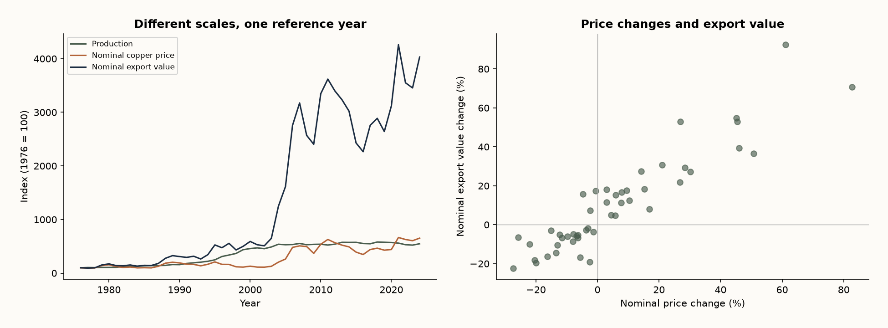

# Chile’s copper: volume versus value

Mining · Official public data

## Business question

What should management monitor when export value grows faster than production?

## Method & validation

Reconcile 49 annual observations from three Cochilco workbooks. Normalize years, verify one-to-one joins, compare growth rates and index each series to 1976. SQL window functions reproduce the annual changes.

## What the data says

In 2024 production rose 4.9%, nominal export value 16.7% and nominal LME price 7.9%. Export growth is not a production-growth metric.

## Recommendation

Maintain separate physical-volume, price and export-value indicators. Investigate their divergence before revising operating capacity assumptions.

## Limits of the evidence

Aggregate annual history through 2024; no mine-level costs, sale contracts or export tonnage. Prices and export values are nominal. Correlation between changes (0.923) is descriptive, not causal. A source typo in 1951 lies outside the 1976–2024 scope; it was not silently corrected.

## Source and artifacts

[COCHILCO · 50 años de la minería en cifras](https://www.cochilco.cl/web/50-anios-de-la-mineria-en-cifras/)



- [Excel dashboard and native PivotTable](dashboard.xlsx)
- [SQL](analysis.sql)
- [Data](annual.csv)
- [Computed metrics](metrics.json)
- [Source hashes](provenance.json)

## Reproduce / Reproducir

From the repository root / Desde la raíz:

```sh
python -m pip install -r tools/requirements-analysis.txt
python tools/build_analysis.py
```

The source workbooks and UCI archive are included; the generator has a fixed seed. Python asserts row coverage, keys, nonnegative demand and agreement with SQL. See tools/build_workbooks.mjs and tools/finalize_excel.ps1 for Excel; the latter requires Windows Excel.

## Power BI

[PBIP project](powerbi/Copper.pbip), two language pages, six bound visuals, DAX measures and a portable Power Query snapshot. The official report-authoring validator reports zero errors/warnings. Desktop has not confirmed opening the report: native rendering and refresh remain unverified. This is not a published Power BI Service report. Regenerate the snapshot with `python tools/build_powerbi.py` after updating the sources.
