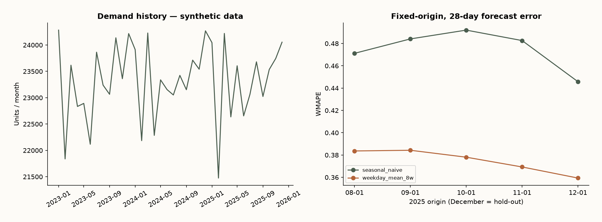

# A forecast a small business can operate

Demand planning · Synthetic simulation

## Business question

With only date, product and demand, can a transparent forecast improve on repeating last week?

## Method & validation

Generate 140,288 daily records for 128 products with a fixed seed. Compare seasonal naive with an eight-week weekday mean over four validation origins; reserve December for one final 28-day hold-out. Forecasts remain fixed at each origin.

## What the data says

The weekday mean reduces held-out WMAPE from 44.6% to 35.9%: a 19.4% relative reduction. 69 products enter volume class A, including the item crossing the 80% threshold.

## Recommendation

Start with the weekday mean as a planning input. Collect stock availability, lead times and actual transactions before recommending reorder quantities or monetizing savings.

## Limits of the evidence

All records are synthetic, not reconstructed client evidence. No prices, lost-sales observations, stock, shelf life or lead times. Volume classes are not revenue ABC. Results describe this generator, not a real business or service-level improvement.

## Source and artifacts

[Reproducible generator · seed 20260907](https://github.com/Chrov/Portfolio/blob/main/tools/build_analysis.py)



- [Excel dashboard and native PivotTable](dashboard.xlsx)
- [SQL](analysis.sql)
- [Data](demand.csv)
- [Computed metrics](metrics.json)
- [Source hashes](provenance.json)

## Reproduce / Reproducir

From the repository root / Desde la raíz:

```sh
python -m pip install -r tools/requirements-analysis.txt
python tools/build_analysis.py
```

The source workbooks and UCI archive are included; the generator has a fixed seed. Python asserts row coverage, keys, nonnegative demand and agreement with SQL. See tools/build_workbooks.mjs and tools/finalize_excel.ps1 for Excel; the latter requires Windows Excel.

## Tableau

[Packaged workbook](dashboard.twbx) contains three Hyper extracts, four worksheets and one bilingual dashboard. Extract contents and XML are validated. Opened and visually checked in Tableau Public Desktop on 2026-09-08. Tableau Public publication still requires sign-in. This is a generated workbook, not a claim of a live published dashboard.


[Market demand / Demanda de feria · Tableau Public](https://public.tableau.com/app/profile/camilo.vergara3198/viz/dashboard_17889881761000/DemandasimuladaSyntheticdemand)

Published dashboard: synthetic demand, forecast validation, volume priority and product counts. / Dashboard publicado: demanda simulada, validación, prioridad por volumen y cantidad de productos.
